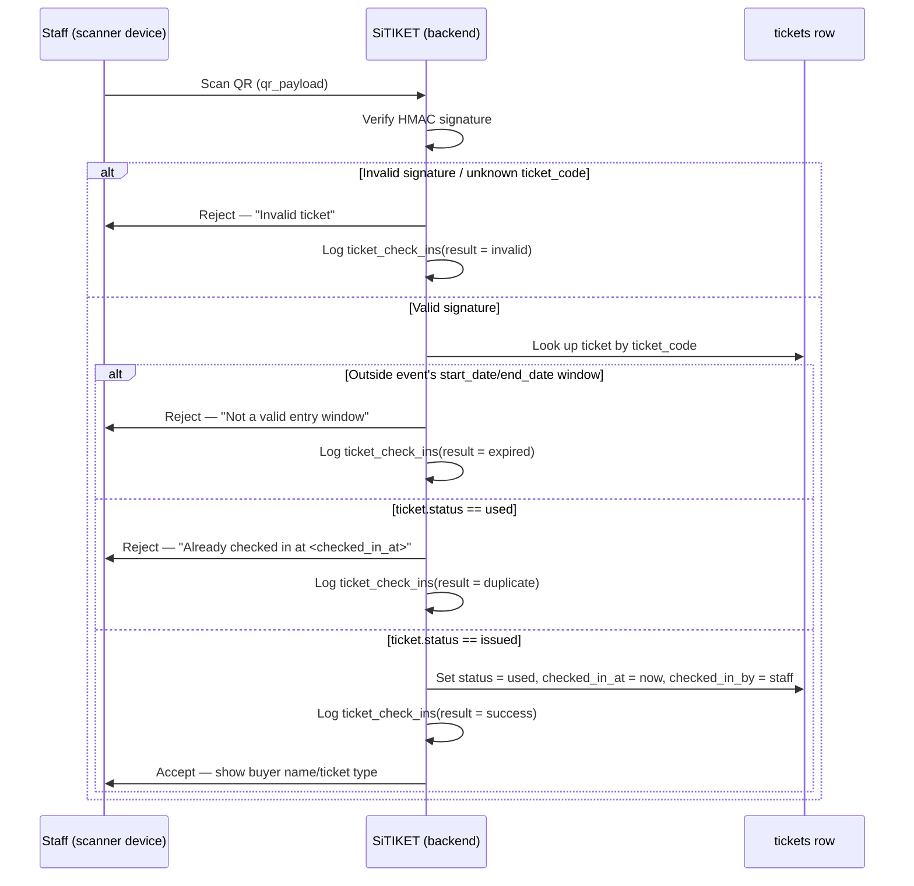

# QR Ticket Lifecycle & Gate Check-In

> Confirmed decision: check-in is handled in-app. Staff scan a buyer's QR at the gate through the platform; the ticket flips to `used` with a timestamp, preventing reuse/duplication. Schema tables referenced below are defined in [DATABASE_DESIGN.md](./DATABASE_DESIGN.md) §4.1 and §4.7.

## 1. Why in-app scanning

Independent/offline QR verification (organizer just eyeballs a code) can't detect a QR that was screenshotted and shared, or presented twice at two different entrances. Routing every scan through the platform gives a single source of truth for "has this ticket already been used" and a full audit trail of scan attempts, which is what makes duplicate/fraud detection possible at all.

## 2. Ticket identity

- Every purchased unit gets its own `tickets` row and its own QR — a 5-ticket order produces 5 independent, individually scannable codes (per spec; see [DATABASE_DESIGN.md](./DATABASE_DESIGN.md) §4.7).
- The QR encodes `tickets.qr_payload`: an HMAC-signed token containing `ticket_code` and `event_id`, not the raw database ID. This means a scanner can validate authenticity offline (signature check) before even hitting the database, and a leaked `ticket_code` alone isn't enough to forge a valid-looking QR.

## 3. Who can scan

Scanning is restricted to people the event owner has explicitly authorized:

- The event's `owner_id` (always allowed), or
- A row in `event_staff` for that event with `role = scanner`.

Staff still authenticate with the same Google sign-in as every other account — there is no separate scanner credential system. The owner adds staff by inviting their Google account (`event_staff.invited_by` records who granted access).

## 4. Scan flow

## 5. Ticket states

| State | Meaning | Entered from |
| --- | --- | --- |
| `issued` | Valid, not yet used. | Order reaches `paid`. |
| `used` | Successfully scanned at the gate. Terminal for normal flow. | A `success` scan on an `issued` ticket. |
| `void` | Manually invalidated. | The parent order is refunded, or an owner manually flags the ticket as fraudulent/duplicated outside the normal scan path. |

A scan against a `void` ticket is logged as `invalid`, same as an unrecognized code — buyers/staff don't need to distinguish "refunded" from "never existed" at the gate.

## 6. Audit log (`ticket_check_ins`)

Every scan attempt is logged, not just successful ones — this is what actually lets an owner investigate "someone tried to get in twice" or "this QR was rejected as invalid, why?" after the fact. Each row records the ticket, who scanned it, when, the `result`, and an optional free-text `device_label` (e.g. `"Gate A - Scanner 2"`) to help narrow down which entrance or device had a problem.

## 7. Operational considerations for implementation (not schema)

- **Offline resilience:** venue Wi-Fi/cellular can be unreliable. The scanner UI should be able to validate a QR's HMAC signature client-side and queue the check-in call, syncing `ticket_check_ins`/`tickets.status` once connectivity returns — otherwise a real network outage at the door either blocks entry entirely or forces staff to fall back to an unverified manual list. This is a frontend/client design concern flagged here for the implementation plan, not a schema change.
- **Race condition at high-traffic gates:** two scanners hitting the same ticket near-simultaneously must resolve through a single atomic transaction (`UPDATE ... WHERE status = 'issued'`, checking rows-affected) so only one can ever win and flip it to `used` — the loser gets a `duplicate` result, not a silent double-success.
- **Staff management UI:** the event owner's dashboard needs a way to add/remove `event_staff` by email/Google account and see each staff member's scan activity — a reasonable v1 addition once the core ticketing flow is in place.
