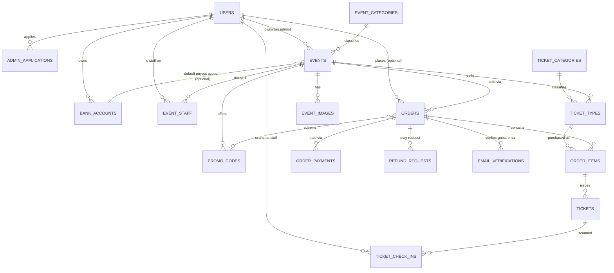

# Database Design

> Source of truth for SiTIKET's relational schema. Any schema change made in code should be reflected here in the same change set.

## 1. Design principles

1. **Relational integrity over convenience.** Money, inventory, and ticket state are modeled with explicit foreign keys and check constraints rather than loose JSON blobs, because overselling or double-issuing a ticket is a direct financial and reputational loss.
2. **Explicit state machines.** Orders, tickets, payment proofs, admin applications, and refunds all move through a named `status` enum with documented transitions (see each entity's *Lifecycle* note) instead of ad-hoc booleans.
3. **Non-enumerable public identifiers.** Anything exposed in a URL, QR code, or shared link (`events.slug`, `tickets.ticket_code`) must not let one record be guessed from another. Use UUID/ULID, not auto-increment integers, for any publicly referenced ID.
4. **Guest-first checkout.** A person never needs an account to buy a ticket. `orders` always carries its own buyer contact fields; `orders.user_id` is a nullable enrichment, never a requirement.
5. **One buyer identity per order, many tickets per order.** Per the product spec, a 5-ticket purchase stores buyer details once on the order and generates 5 individual `tickets` rows (one QR each) — it does not duplicate attendee data per ticket.
6. **Additions beyond the original spec are flagged.** Four tables here (`admin_applications`, `event_staff`, `order_payments`, `refund_requests`, `ticket_check_ins`) were not explicit fields in the original feature list — they were confirmed with the product owner during design (see [SYSTEM_OVERVIEW.md](./SYSTEM_OVERVIEW.md)) and are called out inline as **[confirmed addition]**.

## 2. Technology recommendation

| Decision | Recommendation | Why |
| --- | --- | --- |
| Database engine | **PostgreSQL 16+** | Strong relational integrity, native enum/check-constraint support, `numeric`/`bigint` for money, JSONB escape hatch if ever needed, mature managed offerings (Cloud SQL, Supabase, RDS). |
| ORM / query layer | **Prisma** | TypeScript-first, matches the repo's strict-typing convention (`AGENTS.md`), generates types from schema so frontend/backend share a single source of truth, has a built-in migration workflow. Drizzle ORM is a reasonable lighter-weight alternative if SQL-level control is preferred over Prisma's abstraction. |
| Primary keys | **UUID v4** (or ULID if sortable IDs are wanted for easier debugging/pagination) | Prevents enumeration of other users' orders/events by incrementing an integer in the URL. |
| Money columns | **`integer`, minor unit = whole Rupiah** | IDR has no cents in practice; the existing mock data (`src/data/events.ts`) already stores whole-Rupiah integers (e.g. `75000`). Never use `float`/`double` for money. |
| Timestamps | **`timestamptz`, stored in UTC** | Avoids ambiguity; convert to `Asia/Jakarta` (WIB) only at the presentation layer, matching the `"16:00 WIB"` display format already used in the UI. |

## 3. Entity overview (ERD)



## 4. Entity reference

### 4.1 Identity & access

#### `users`

| Column | Type | Notes |
| --- | --- | --- |
| `id` | uuid PK | |
| `google_sub` | text, unique, not null | Google OAuth subject ID; the only login method (spec §"Sign in with Google"). |
| `email` | citext/text, unique, not null | |
| `email_verified_at` | timestamptz, nullable | Set automatically at first Google sign-in, since Google-verified emails are inherently confirmed. Satisfies the spec's `email_verified_at` requirement for logged-in buyers. |
| `name` | text, not null | |
| `phone` | text, nullable | Collected post-signup; used to prefill checkout. |
| `avatar_url` | text, nullable | From Google profile. |
| `role` | enum `user_role` (`user`, `admin`, `super_admin`), default `user` | |
| `status` | enum `user_status` (`active`, `suspended`), default `active` | Lets a Super Admin disable an abusive account without deleting history. |
| `created_at` / `updated_at` | timestamptz | |

**Lifecycle:** every account starts as `user`. Promotion to `admin` only happens through `admin_applications` approval (never self-service — confirmed decision). Promotion to `super_admin` is a manual, out-of-band operation (no self-serve path; there is intentionally no UI for this).

#### `admin_applications` — **[confirmed addition]**

Event-owner accounts require Super Admin approval before they can create events, per the confirmed decision in [SYSTEM_OVERVIEW.md](./SYSTEM_OVERVIEW.md).

| Column | Type | Notes |
| --- | --- | --- |
| `id` | uuid PK | |
| `user_id` | uuid FK → `users.id`, not null | |
| `business_name` | text, not null | Organizer/company name shown to Super Admin during review. |
| `business_description` | text, nullable | |
| `contact_phone` | text, not null | |
| `status` | enum `admin_application_status` (`pending`, `approved`, `rejected`), default `pending` | |
| `reviewed_by` | uuid FK → `users.id`, nullable | Must be a `super_admin`. |
| `reviewed_at` | timestamptz, nullable | |
| `review_notes` | text, nullable | Reason shown back to the applicant, especially on rejection. |
| `created_at` | timestamptz | |

**Lifecycle:** `pending → approved` (sets `users.role = 'admin'`) or `pending → rejected`. A rejected applicant may re-apply (insert a new row); history of prior attempts is preserved.

#### `event_staff` — **[confirmed addition]**

Gate check-in requires someone physically at the venue to scan QR codes. That person is not necessarily the event owner, so events need a delegated, permission-scoped staff role.

| Column | Type | Notes |
| --- | --- | --- |
| `id` | uuid PK | |
| `event_id` | uuid FK → `events.id`, not null | |
| `user_id` | uuid FK → `users.id`, not null | Staff must still sign in with Google — no separate credential system. |
| `role` | enum `event_staff_role` (`scanner`), default `scanner` | Single role for v1; kept as an enum so a future `co_organizer` role doesn't require a schema migration. |
| `invited_by` | uuid FK → `users.id`, not null | Must be the event's `owner_id` or a `super_admin`. |
| `created_at` | timestamptz | |

Unique constraint: `(event_id, user_id)`.

### 4.2 Taxonomy (Super Admin managed)

#### `event_categories`

| Column | Type | Notes |
| --- | --- | --- |
| `id` | uuid PK | |
| `name` | text, not null | e.g. `Live Music` |
| `slug` | text, unique, not null | e.g. `live-music` |
| `is_active` | boolean, default true | Deactivating hides it from the "create event" picker without deleting historical references. |
| `sort_order` | integer, default 0 | Controls display order in filters/nav. |
| `created_at` / `updated_at` | timestamptz | |

Seed values: `Sports`, `Comedy`, `Game`, `Live Music`, `Concert`, `Community`.

#### `ticket_categories`

Same shape as `event_categories`. Seed values: `Early Bird`, `Pre Sale`, `Regular`.

Both tables are CRUD-managed exclusively by `super_admin` — enforce at the API authorization layer, not just the UI.

### 4.3 Payout accounts

#### `bank_accounts`

| Column | Type | Notes |
| --- | --- | --- |
| `id` | uuid PK | |
| `owner_id` | uuid FK → `users.id`, not null | Must be an `admin`. |
| `bank_name` | text, not null | e.g. `BCA`, `Mandiri`. |
| `account_number` | text, not null | |
| `account_holder_name` | text, not null | |
| `is_default` | boolean, default false | The account pre-selected when creating a new event; an event can still override with a different one of the owner's accounts. |
| `created_at` / `updated_at` | timestamptz | |

Index: `owner_id`. Application rule: exactly one `is_default = true` row per owner (enforce with a partial unique index `WHERE is_default`).

### 4.4 Events

#### `events`

| Column | Type | Notes |
| --- | --- | --- |
| `id` | uuid PK | |
| `owner_id` | uuid FK → `users.id`, not null | Must be an `admin`. |
| `category_id` | uuid FK → `event_categories.id`, not null | |
| `name` | text, not null | |
| `slug` | text, unique, not null | Public URL identifier, e.g. `/events/jakarta-noise-fest`. |
| `description` | text, not null | |
| `status` | enum `event_status` (`draft`, `published`, `cancelled`, `completed`), default `draft` | |
| `is_visible` | boolean, default true | Dashboard toggle from spec §"toggle to enable/disable event visibility" — deliberately independent from `status`, so an owner can hide a *published* event (e.g., pause sales) without reclassifying it as draft/cancelled. |
| `start_date` | timestamptz, not null | |
| `end_date` | timestamptz, not null | Validity window; check constraint `end_date >= start_date`. |
| `venue_name` | text, nullable | Null for fully online events. |
| `address` | text, nullable | |
| `city` | text, nullable | |
| `province` | text, nullable | |
| `country` | text, default `'Indonesia'` | |
| `meeting_url` | text, nullable | For online/hybrid events. |
| `meeting_platform` | enum `meeting_platform` (`zoom`, `google_meet`, `other`), nullable | |
| `contact_person_name` | text, not null | |
| `contact_person_email` | text, not null | |
| `contact_person_phone` | text, not null | |
| `bank_account_id` | uuid FK → `bank_accounts.id`, nullable | If null, resolve to the owner's `is_default` account at checkout time. |
| `max_tickets_per_user` | integer, not null, default 10 | Owner-configurable cap enforced when creating an order (spec §"maximum tickets purchase... the owner deciding it"). |
| `created_at` / `updated_at` | timestamptz | |

Indexes: `owner_id`, `category_id`, `status`, `is_visible`.

**Lifecycle:** `draft → published → completed`, or `→ cancelled` from either `draft` or `published`. Cancelling stops new sales; existing paid orders move to the manual refund flow (see `refund_requests`). `is_visible` can flip independently at any status.

#### `event_images`

| Column | Type | Notes |
| --- | --- | --- |
| `id` | uuid PK | |
| `event_id` | uuid FK → `events.id`, not null | |
| `image_url` | text, not null | |
| `is_poster` | boolean, default false | Exactly one poster per event — enforce with a partial unique index `WHERE is_poster`. |
| `width` / `height` | integer, not null | Validate the poster against Instagram feed (1080×1080) or story (1080×1920) at upload time. |
| `sort_order` | integer, default 0 | Gallery ordering. |
| `created_at` | timestamptz | |

### 4.5 Ticket inventory & pricing

#### `ticket_types`

An event can sell several of these concurrently (e.g. "Early Bird", "Regular — Zone A"), each tagged with one of the three global `ticket_categories`.

| Column | Type | Notes |
| --- | --- | --- |
| `id` | uuid PK | |
| `event_id` | uuid FK → `events.id`, not null | |
| `category_id` | uuid FK → `ticket_categories.id`, not null | |
| `name` | text, not null | |
| `price` | integer, not null | Whole Rupiah. |
| `quantity_total` | integer, not null | The stock the owner decides to sell. |
| `quantity_sold` | integer, not null, default 0 | Denormalized counter, incremented transactionally on order confirmation; check constraint `quantity_sold <= quantity_total`. |
| `sale_start_at` / `sale_end_at` | timestamptz, nullable | Lets "Early Bird" auto-close and "Regular" take over without manual toggling. |
| `is_active` | boolean, default true | |
| `created_at` / `updated_at` | timestamptz | |

Index: `event_id`.

#### `promo_codes`

Scoped to a single event, per spec §"create promo code for the event."

| Column | Type | Notes |
| --- | --- | --- |
| `id` | uuid PK | |
| `event_id` | uuid FK → `events.id`, not null | |
| `code` | text, not null | Unique per event: `(event_id, code)`. |
| `discount_type` | enum `discount_type` (`percentage`, `fixed_amount`) | |
| `discount_value` | numeric, not null | Percentage (0–100) or a flat Rupiah amount, per `discount_type`. |
| `max_uses` | integer, not null | |
| `used_count` | integer, not null, default 0 | Check constraint `used_count <= max_uses`. |
| `valid_from` / `valid_until` | timestamptz, nullable | Expiration window from spec. |
| `is_active` | boolean, default true | Manual kill switch independent of the date window. |
| `created_at` / `updated_at` | timestamptz | |

### 4.6 Orders & payment (manual bank-transfer, v1)

See [PAYMENT_VERIFICATION.md](./PAYMENT_VERIFICATION.md) for the full flow narrative; this section is the schema only.

#### `orders`

| Column | Type | Notes |
| --- | --- | --- |
| `id` | uuid PK | |
| `event_id` | uuid FK → `events.id`, not null | |
| `user_id` | uuid FK → `users.id`, nullable | Null for guest checkout. |
| `buyer_name` | text, not null | Always captured — prefilled from `users` when logged in, typed manually otherwise. |
| `buyer_email` | text, not null | |
| `buyer_phone` | text, not null | |
| `guest_email_verified_at` | timestamptz, nullable | Only meaningful when `user_id` is null; see [PAYMENT_VERIFICATION.md](./PAYMENT_VERIFICATION.md) for when this is required before an order can proceed. |
| `promo_code_id` | uuid FK → `promo_codes.id`, nullable | |
| `subtotal_amount` | integer, not null | Sum of `order_items.subtotal` before discount. |
| `discount_amount` | integer, not null, default 0 | |
| `total_amount` | integer, not null | `subtotal_amount - discount_amount`. Always recomputed server-side; never trust a client-submitted total. |
| `status` | enum `order_status` (see below), default `pending_payment` | |
| `payment_expires_at` | timestamptz, not null | Reservation hold deadline; expiring orders release their `ticket_types.quantity_sold` hold. |
| `created_at` / `updated_at` | timestamptz | |

`order_status` values: `pending_payment`, `awaiting_verification`, `paid`, `expired`, `cancelled`, `refund_requested`, `refunded`, `refund_rejected`.

**Lifecycle:**
```
pending_payment ──(proof uploaded)──> awaiting_verification ──(owner approves)──> paid
pending_payment ──(hold expires)────> expired
pending_payment / awaiting_verification ──(buyer/owner cancels)──> cancelled
paid ──(refund requested)──> refund_requested ──> refunded | refund_rejected
```

#### `order_items`

| Column | Type | Notes |
| --- | --- | --- |
| `id` | uuid PK | |
| `order_id` | uuid FK → `orders.id`, not null | |
| `ticket_type_id` | uuid FK → `ticket_types.id`, not null | |
| `quantity` | integer, not null | |
| `unit_price` | integer, not null | Snapshot of `ticket_types.price` at purchase time — never re-read the live price after purchase. |
| `subtotal` | integer, not null | `quantity * unit_price`. |
| `created_at` | timestamptz | |

#### `order_payments` — **[confirmed addition]**

One row per proof-of-transfer submission. Modeled as one-to-many (not one-to-one) because a rejected proof can be re-submitted; the most recent row by `submitted_at` is authoritative.

| Column | Type | Notes |
| --- | --- | --- |
| `id` | uuid PK | |
| `order_id` | uuid FK → `orders.id`, not null | |
| `bank_account_id` | uuid FK → `bank_accounts.id`, not null | The destination account shown to the buyer at checkout (resolved from the event, see §4.4). |
| `amount` | integer, not null | What the buyer claims to have transferred. |
| `proof_image_url` | text, not null | |
| `transfer_note` | text, nullable | Optional buyer-entered reference/note. |
| `status` | enum `order_payment_status` (`pending_review`, `approved`, `rejected`), default `pending_review` | |
| `reviewed_by` | uuid FK → `users.id`, nullable | The event owner (or a `super_admin`) who reviewed it. |
| `reviewed_at` | timestamptz, nullable | |
| `reviewer_notes` | text, nullable | Shown back to the buyer, especially on rejection. |
| `submitted_at` | timestamptz, not null | |

Index: `order_id`.

#### `refund_requests` — **[confirmed addition]**

Manual/offline refunds, status-tracked only — no payment-gateway refund API in v1 (confirmed decision).

| Column | Type | Notes |
| --- | --- | --- |
| `id` | uuid PK | |
| `order_id` | uuid FK → `orders.id`, not null | |
| `requested_by` | uuid FK → `users.id`, nullable | Null when the requester was a guest buyer (identify them via the order's `buyer_email` instead). |
| `reason` | text, not null | |
| `status` | enum `refund_status` (`requested`, `approved`, `rejected`, `completed`), default `requested` | `completed` marks that money has actually moved back offline — a distinct step from `approved` so "decided to refund" and "money sent" aren't conflated. |
| `processed_by` | uuid FK → `users.id`, nullable | |
| `processed_at` | timestamptz, nullable | |
| `notes` | text, nullable | |
| `created_at` / `updated_at` | timestamptz | |

The parent `orders.status` mirrors the latest `refund_requests.status` (`refund_requested` / `refunded` / `refund_rejected`) so order listings don't need a join for the common case.

### 4.7 Tickets & gate check-in

See [CHECKIN_GATE_SYSTEM.md](./CHECKIN_GATE_SYSTEM.md) for the scanning flow narrative.

#### `tickets`

One row per purchased ticket unit — buying 5 tickets in one order produces 5 rows here, each with its own QR.

| Column | Type | Notes |
| --- | --- | --- |
| `id` | uuid PK | |
| `order_item_id` | uuid FK → `order_items.id`, not null | |
| `ticket_code` | text, unique, not null | Unguessable (ULID or UUID), the human-visible/scannable identifier. |
| `qr_payload` | text, not null | An HMAC-signed token embedding `ticket_code` + `event_id`, so a photographed/forwarded QR can't be trivially forged even if `ticket_code` leaked. |
| `status` | enum `ticket_status` (`issued`, `used`, `void`), default `issued` | |
| `checked_in_at` | timestamptz, nullable | |
| `checked_in_by` | uuid FK → `users.id`, nullable | The staff/owner account that performed the successful scan. |
| `created_at` | timestamptz | |

**Lifecycle:** `issued → used` on a successful gate scan (spec: ticket becomes "used" status with a timestamp, preventing reuse/duplication). `issued`/`used → void` if the parent order is refunded or the ticket is manually invalidated for fraud.

#### `ticket_check_ins` — **[confirmed addition]**

Audit log of every scan *attempt*, not just successful ones — required to actually detect and investigate duplicate/fraudulent entry attempts, not just block them silently.

| Column | Type | Notes |
| --- | --- | --- |
| `id` | uuid PK | |
| `ticket_id` | uuid FK → `tickets.id`, not null | |
| `scanned_by` | uuid FK → `users.id`, not null | Must be the event's `owner_id` or a row in `event_staff`. |
| `scanned_at` | timestamptz, not null | |
| `result` | enum `check_in_result` (`success`, `duplicate`, `invalid`, `expired`), not null | `duplicate` = already `used`; `invalid` = signature/lookup failure; `expired` = scanned outside the event's date window. |
| `device_label` | text, nullable | Free-text gate/device identifier (e.g. `"Gate A - Scanner 2"`), useful when triaging which entrance had a problem. |
| `created_at` | timestamptz | |

Index: `ticket_id`.

### 4.8 Guest email verification — **[confirmed addition]**

Generic table so both signup edge cases and guest checkout share one verification mechanism, per spec §"Need email verification... for preventing false email."

#### `email_verifications`

| Column | Type | Notes |
| --- | --- | --- |
| `id` | uuid PK | |
| `email` | text, not null | |
| `purpose` | enum `verification_purpose` (`guest_checkout`, `account`) | |
| `order_id` | uuid FK → `orders.id`, nullable | Set when `purpose = guest_checkout`. |
| `user_id` | uuid FK → `users.id`, nullable | Set when `purpose = account` (rare — Google sign-in already verifies account emails). |
| `code` | text, not null | OTP or single-use token, emailed to the buyer. |
| `expires_at` | timestamptz, not null | |
| `verified_at` | timestamptz, nullable | |
| `created_at` | timestamptz | |

**Rule:** a guest order may not move past `pending_payment` (i.e., may not accept a payment proof) until its linked `email_verifications` row for `guest_checkout` has `verified_at` set. Logged-in buyers skip this — their `users.email_verified_at` from Google sign-in already satisfies it.

## 5. Cross-cutting business rules and how the schema enforces them

| Rule | Enforcement |
| --- | --- |
| Never oversell a ticket type | `ticket_types.quantity_sold <= quantity_total` check constraint, incremented inside the same DB transaction that confirms an order — reserve inventory at `pending_payment` creation, not at `paid`, so two buyers can't both hold the last seat. |
| Never trust a client-submitted price/total | `order_items.unit_price` and `orders.total_amount` are always computed server-side from `ticket_types.price` and `promo_codes` at write time. |
| One buyer identity per order | `buyer_name`/`buyer_email`/`buyer_phone` live once on `orders`, never duplicated onto `tickets`. |
| Per-event, per-user purchase cap | Enforced in the order-creation service: sum `order_items.quantity` across the buyer's (`user_id` or `buyer_email`) non-cancelled/non-expired orders for the event, reject if it would exceed `events.max_tickets_per_user`. |
| A ticket can't be scanned twice | `tickets.status` transitions `issued → used` atomically inside the scan transaction; a second scan attempt reads `status = used`, is rejected, and is still logged as a `ticket_check_ins` row with `result = duplicate`. |
| Only Super Admin manages taxonomy | Authorization check at the API layer on `event_categories`/`ticket_categories` writes — not expressible as a DB constraint, must be enforced in application code. |
| Admin accounts require approval | `users.role` only transitions to `admin` as a side effect of `admin_applications.status → approved`; there is no direct write path for a user to self-promote. |

## 6. Open items / assumptions to confirm before implementation

- **Multiple contact persons per event:** spec says "input contact person" (singular); modeled as three columns on `events`. If an event ever needs more than one contact, promote this to an `event_contacts` table.
- **`ticket_categories` vs. dynamic pricing tiers:** the three global categories (Early Bird/Pre Sale/Regular) are treated as a classification tag on `ticket_types`, not as automatic date-based pricing rules. `ticket_types.sale_start_at`/`sale_end_at` handle the actual timing; confirm this matches intent.
- **Payout account currency/verification:** `bank_accounts` stores raw account numbers with no external verification (e.g. name-matching via a bank API) in v1 — purely owner-declared, reviewed manually alongside payment proofs.
- **Offline gate scanning:** venues with unreliable connectivity may need the scanner UI to queue scans locally and sync `ticket_check_ins` when back online. Not modeled as a schema concern, but flagged for the frontend implementation plan — see [CHECKIN_GATE_SYSTEM.md](./CHECKIN_GATE_SYSTEM.md).
