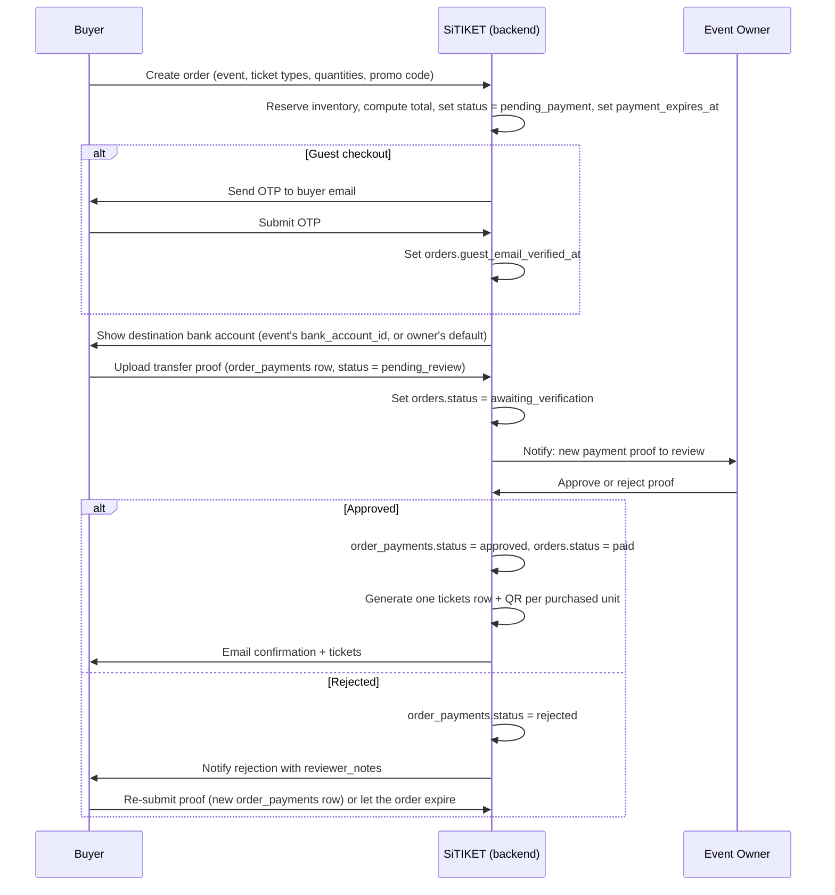

# Payment Verification — v1 (Manual Bank Transfer)

> Confirmed decision: v1 ships with manual bank transfer + proof upload, reviewed by the event owner. No payment gateway integration yet. Schema tables referenced below are defined in [DATABASE_DESIGN.md](./DATABASE_DESIGN.md) §4.6.

## 1. Why manual for v1

Integrating a payment gateway (Midtrans/Xendit) requires a merchant account, KYC/business verification, and settlement/payout wiring per event owner — real business setup that can't be assumed to exist yet for every organizer on day one. Manual bank transfer lets any approved Admin start selling tickets immediately using a bank account they already have, at the cost of a slower, human-reviewed confirmation step.

## 2. Roles involved

- **Buyer** — transfers money and uploads proof.
- **Event owner (Admin)** — reviews proof, approves or rejects it. This is the default reviewer.
- **Super Admin** — can also review/approve on an owner's behalf (support/escalation case), but is not the primary path.

## 3. End-to-end flow

## 4. States and transitions

### Order (`orders.status`)

| From | To | Trigger |
| --- | --- | --- |
| `pending_payment` | `awaiting_verification` | Buyer uploads a transfer proof (`order_payments` row created). |
| `pending_payment` | `expired` | `payment_expires_at` passes with no proof uploaded — release the reserved inventory. |
| `awaiting_verification` | `paid` | Owner approves the proof. |
| `awaiting_verification` | `pending_payment` | Owner rejects the proof — buyer may re-submit. |
| `pending_payment` / `awaiting_verification` | `cancelled` | Buyer or owner explicitly cancels before payment is confirmed. |
| `paid` | `refund_requested` → `refunded` / `refund_rejected` | See refund flow below. |

### Payment proof (`order_payments.status`)

`pending_review → approved` or `pending_review → rejected`. A rejected order can receive a new `order_payments` row (re-submission); the row with the latest `submitted_at` is authoritative for the order's current payment state.

## 5. Edge cases

| Case | Handling |
| --- | --- |
| Buyer never uploads proof | Order auto-expires at `payment_expires_at`; reserved ticket-type inventory is released back to `quantity_total - quantity_sold`. |
| Buyer uploads proof, owner never reviews it | Out of scope for automated handling in v1 — flagged as an operational gap; consider a reminder notification to the owner after N hours (implementation detail, not a schema concern). |
| Owner rejects with a reason | `reviewer_notes` is shown to the buyer; buyer can submit a corrected proof against the same order as long as it hasn't expired. |
| Amount transferred doesn't match `orders.total_amount` | Not automatically validated in v1 (no bank statement integration) — the owner is expected to visually confirm the amount from the proof image / their own bank app before approving. Flag as a known manual-verification limitation. |
| Event is cancelled after an order is `paid` | Order moves into the manual refund flow — buyer or owner files a `refund_requests` row; no automatic refund happens. |

## 6. Future migration path: payment gateway (Midtrans/Xendit)

This is explicitly deferred, but the schema is designed so it layers on rather than requiring a rework:

1. Add a `payment_provider_transactions` table: `order_id`, `provider` (`midtrans`/`xendit`), `provider_reference`, `status`, `raw_webhook_payload`, timestamps.
2. Add `orders.payment_method` (`manual_transfer` / `gateway`) so both paths can coexist — an owner without a merchant account keeps using manual transfer while others use the gateway.
3. Webhook handler verifies the provider signature, then transitions `orders.status` `pending_payment → paid` automatically (skipping `awaiting_verification` entirely for gateway orders).
4. `order_payments` remains exactly as-is for any owner who still opts into manual transfer — the two payment methods are not mutually exclusive at the schema level.
5. Refunds become callable through the provider's refund API from a `refund_requests.status = approved` row instead of being purely manual — see the "Automated via payment gateway" option that was deferred in this design pass.

No currently-designed table needs to be dropped or restructured to support this — it is additive.
